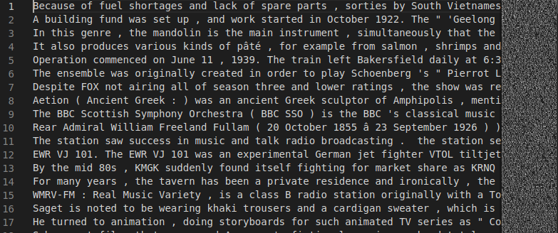
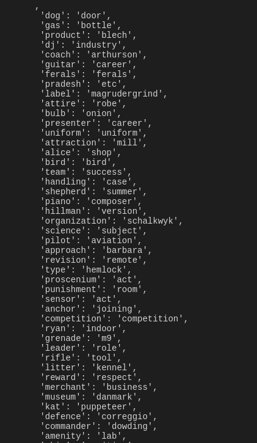

# Hearst-Hypernym-Extractor
Hearst Patterns to extract Hypernyms from text

> Hypernymy is the is-a relation between two words.

For Example:
Music like Rock and Metal

Rock is a type of Music and Metal is a type of music

**Hypernym** : Music

**Hyponym**  : Rock, Metal

Scope of this repository is to implement Hearst Patterns on our data(we will use various soures), to extrat Hypernyms and Hyponyms from it. We will also extend this with various other approaches (Documentation for the same will be added as and when new models are added or changes are made)

### Objective

Extract Hypernym-Hyponym Pairs from text corpora

### Input :

( Dataset from https://nlp.cis.upenn.edu/)

Input is a string of 288963 Wikipedia Sentences. Here is how the data looks:

### Output :
The initial output from the program is a list of Hypernym:Hyponym pairs represented as  a python [dict](https://docs.python.org/3/tutorial/datastructures.html#dictionaries)
As we progress in our notebook, we will be evaluating various metrics on different datasets using various methods, But the goal will be the same: To extract Hypernym-Hyponym pairs from text

This is what the output looks like:

Facebook AI paper [Hearst Patterns Revisited](https://research.fb.com/wp-content/uploads/2018/07/Hearst-Patterns-Revisited-Automatic-Hypernym-Detection-from-Large-Text-Corpora.pdf?) shows that pattern based methods outperform other methods. 

Explanation of Approach for Hearst Pattern Extraction:

Hearst Patterns: [Marti Hearst]  (https://www.aclweb.org/anthology/C92-2082.pdf) paper describes certain lexico-syntactic patterns that 
occur in text which can aid in the extraction of Hypernyms. 

We implement these patterns and extend it with some more patterns to extract Hearst Patterns from text.

Steps
------

1) Import the necessary libraries: nltk, regular expression(regex) and Perceptron Tagger from nltk

2) Create a noun-phrase chunker which extracts the NN or Noun phrases from a text which has already been tagged using Perceptron
   Tagger
   
3) Input Hearst Patterns + Additional Patterns to use for extraction:
   Format: (pattern,position of hypernym in the pattern)
               
               '(NP_\\w+ (, )?such as (NP_\\w+ ?(, )?(and |or )?)+)','first'), 
                
                '(such NP_\\w+ (, )?as (NP_\\w+ ?(, )?(and |or )?)+)','first'),
                
                '((NP_\\w+ ?(, )?)+(and |or )?other NP_\\w+)','last'),
                
                '(NP_\\w+ (, )?include (NP_\\w+ ?(, )?(and |or )?)+)','first'),
                
                '(NP_\\w+ (, )?especially (NP_\\w+ ?(, )?(and |or )?)+)','first'),
                
                '((NP_\\w+ ?(, )?)+(and |or )?any other NP_\\w+)','last'),
                
                '((NP_\\w+ ?(, )?)+(and |or )?some other NP_\\w+)','last'),
                
                '((NP_\\w+ ?(, )?)+(and |or )?be a NP_\\w+)','last'),
                
                '(NP_\\w+ (, )?like (NP_\\w+ ? (, )?(and |or )?)+)','first),
                
                'such (NP_\\w+ (, )?as (NP_\\w+ ? (, )?(and |or )?)+)','first'),
                
                '((NP_\\w+ ?(, )?)+(and |or )?like other NP_\\w+)','last'),
                
                '((NP_\\w+ ?(, )?)+(and |or )?one of the NP_\\w+)','last'),
                
                '((NP_\\w+ ?(, )?)+(and |or )?one of these NP_\\w+)','last'),
                
                '((NP_\\w+ ?(, )?)+(and |or )?one of those NP_\\w+)','last'),
                
                'example of (NP_\\w+ (, )?be (NP_\\w+ ? ''(, )?(and |or )?)+)','first'),
                
                '((NP_\\w+ ?(, )?)+(and |or )?be example of NP_\\w+)','last'),
                
                '(NP_\\w+ (, )?for example (, )?,'first'),
                
                '(NP_\\w+ ?(, )?(and |or )?)+)','first'),
                
                '((NP_\\w+ ?(, )?)+(and |or )?which be call NP_\\w+)','last'),
                
                '((NP_\\w+ ?(, )?)+(and |or )?which be name NP_\\w+)','last'),
                
                '(NP_\\w+ (, )?mainly (NP_\\w+ ? (, )?(and |or )?)+)','first'),
                
                '(NP_\\w+ (, )?mostly (NP_\\w+ ? (, )?(and |or )?)+)','first'),
                
                '(NP_\\w+ (, )?notably (NP_\\w+ ? (, )?(and |or )?)+)','first'),
                
                '(NP_\\w+ (, )?particularly (NP_\\w+ ? ''(, )?(and |or )?)+)','first'),
                
                '(NP_\\w+ (, )?principally (NP_\\w+ ? (, )?(and |or )?)+)','first'),
                
                '(NP_\\w+ (, )?in particular (NP_\\w+ ? (, )?(and |or )?)+)','first'),
                
                '(NP_\\w+ (, )?except (NP_\\w+ ? (, )?(and |or )?)+)','first'),
                
                '(NP_\\w+ (, )?other than (NP_\\w+ ? (, )?(and |or )?)+)','first'),
                
                '(NP_\\w+ (, )?e.g. (, )?(NP_\\w+ ? (, )?(and |or )?)+)','first'),
                
                '(NP_\\w+ \\( (e.g.|i.e.) (, )?(NP_\\w+ ? (, )?(and |or )?)+''(\\. )?\\))','first'),
                
                '(NP_\\w+ (, )?i.e. (, )?(NP_\\w+ ? (, )?(and |or )?)+)','first'),
                
                '((NP_\\w+ ?(, )?)+(and|or)? a kind of NP_\\w+)','last'),
                
                '((NP_\\w+ ?(, )?)+(and|or)? kind of NP_\\w+)','last'),
                
                '((NP_\\w+ ?(, )?)+(and|or)? form of NP_\\w+)','last'),
                
                '((NP_\\w+ ?(, )?)+(and |or )?which look like NP_\\w+)','last'),
                
                '((NP_\\w+ ?(, )?)+(and |or )?which sound like NP_\\w+)','last'),
                
                '(NP_\\w+ (, )?which be similar to (NP_\\w+ ? ''(, )?(and |or )?)+)','first'),
                
                '(NP_\\w+ (, )?example of this be (NP_\\w+ ? ''(, )?(and |or )?)+)','first'),
                
                '(NP_\\w+ (, )?type (NP_\\w+ ? (, )?(and |or )?)+)','first'),
                
                '((NP_\\w+ ?(, )?)+(and |or )? NP_\\w+ type)','last'),
                
                '(NP_\\w+ (, )?whether (NP_\\w+ ? (, )?(and |or )?)+)','first'),
                
                '(compare (NP_\\w+ ?(, )?)+(and |or )?with NP_\\w+)','last'),
                
                '(NP_\\w+ (, )?compare to (NP_\\w+ ? (, )?(and |or )?)+)''first'),
                
                '(NP_\\w+ (, )?among -PRON- (NP_\\w+ ? (, )?(and |or )?)+)','first')
                
                '((NP_\\w+ ?(, )?)+(and |or )?as NP_\\w+)','last'),
                
                '(NP_\\w+ (, )? (NP_\\w+ ? (, )?(and |or )?)+  'for instance)','first' ),
                
                '((NP_\\w+ ?(, )?)+(and|or)? sort of NP_\\w+)','last' ),
                
                '(NP_\\w+ (, )?which may include (NP_\\w+ ''?(, )?(and |or )?)+)','first')
                

4) Part of Speech tagging of text using Perceptron Tagger (Inbuilt in nltk)

5) Preprocessing of Text. Tokenize text into sentences, tokenize sentences into words, tag each word and return pos tagged sentences

6) Implement the noun phrase chunker we had created at the start to extract noun phrases from the pos tagged words in the sentence
   and put them in the format of the hearst pattern patterns used to extract:
   
   For example:
   
   I like music like metal and rock, would be converted to,
   
   I like NP_music like NP_metal and NP_rock
   
 
7) There might be cases where some noun phrases span multiple words in the sentence. We merge them into one if they do not have
   any other syntax in between them.
   
   For example:
   
   I like cities like New York, first converted to,
   
   I like NP_cities like NP_New NP_York, then merged to,
   
   I like NP_cities like NP_New_York
   

8) Match the Hearst Patterns in the the sample text with re.match and output list like:

   [NP_music,NP_rock,NP_metal]

9) Use the function find_hyponyms to extract hypernyms using this function from a corpus of wikipedia text 

10) Feed hyponyms and hypernyms into a dictionary mapped as key:value as hypernym:hyponym even if multiple hyponyms have been extracted for a single hypernym

11) Our Hypernyms and Hyponyms have multi-word noun phrases. We extract the noun pairs using the knowledge that the Noun phrase usually occurs at the last token/the head of the noun phrase is at the last token

12) We also the step to lemmatize our hyponyms and hypernyms to get better generalization on the test data

13) We extract the hypernym-hyponym pairs from the BLESS data that match the ones we extracted from Wikipedia sentences 

14) We create a prediction column from both the files and map it as True=1 and False=0

15) We evaluate Precision, Recall and F1 Score on the truth values and the precited pairs:

### BLESS 2011 Data
|Precision   |Recall | F1-Score|
|------------|-------|---------|
|0.16        |0.83   |0.30     |

